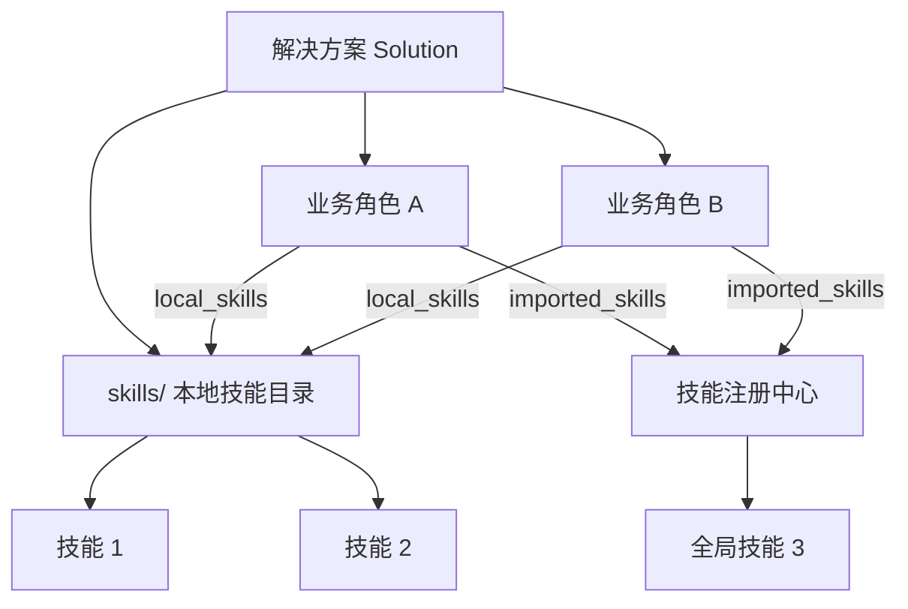

# 核心概念

Blade Agent 通过三个核心概念组织智能体的能力：**解决方案**、**业务角色**和**技能**。

## 解决方案（Solution）

解决方案是一组预配置的角色、技能和配置的集合，面向特定业务场景。通过解决方案，可以为智能体指定特定的技能和角色，让它可控地解决问题。

**举例：**

- **智能招投标** -- 包含标书分析、合规检查等角色，每个角色只使用招投标相关技能，确保输出专业、准确。
- **软件工程** -- 包含需求分析、UI 设计、任务拆分等角色，按流程逐步推进软件开发的各个环节。

## 业务角色（BizRole）

业务角色是解决方案内的具体工作角色。同一个解决方案下的不同角色擅长处理不同类型的任务。

例如在「软件工程」解决方案中：

- **PRD 需求设计师** -- 以产品经理视角梳理功能需求与业务流程
- **UI 设计师** -- 专注于界面设计
- **任务拆分** -- 将需求拆解为可执行的开发任务

每个角色可以引用自己需要的技能组合，拥有独立的提示词和初始行为配置。

## 技能（Skill）

技能是智能体可调用的能力单元，以 `SKILL.md` 文件为核心定义。技能可以是 Solution 包内的本地技能（`local_skills`），也可以是从技能注册中心引入的全局技能（`imported_skills`）。

## 三者关系

- Solution 包含一个或多个 BizRole，以及一个共享的 `skills/` 目录。
- BizRole 通过 `local_skills` 引用 Solution 包内的技能，通过 `imported_skills` 引用技能注册中心的全局技能。
- 多个 BizRole 可以引用同一个本地技能，技能不需要重复存放。
