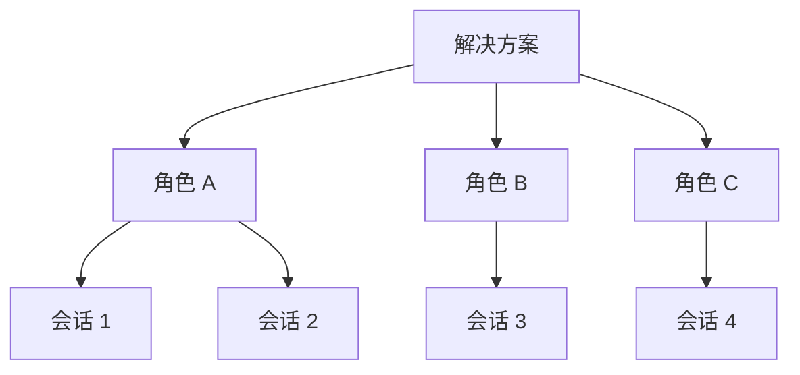

# 解决方案与角色

## 什么是解决方案

解决方案是预配置好的智能体能力集合。通过解决方案，可以为智能体指定特定的技能和角色，让它可控地解决特定领域的问题。

**举例：**

- 「智能招投标」解决方案：包含标书分析、合规检查等角色，每个角色只使用招投标相关技能，确保输出专业、准确。
- 「软件工程」解决方案：包含需求分析、UI 设计、任务拆分等角色，覆盖软件开发的各个环节。

## 解决方案、角色与会话的关系

一个解决方案下可以有多个角色，每个角色可以发起多个独立的会话。

## 选择和切换解决方案

打开「智能助手」后，在顶部选择你需要的解决方案。不同解决方案提供不同的能力和角色组合。

## 角色的作用

同一个解决方案下的不同角色，擅长处理不同类型的任务。例如在「软件工程」解决方案中：

- 「需求分析」角色专注于梳理和分析需求
- 「UI 设计」角色专注于界面设计
- 「任务拆分」角色专注于将需求拆解为可执行的开发任务

选择合适的角色，能让智能体更高效地完成你的需求。

## 切换角色

切换角色时会自动创建新的会话。这是因为不同角色使用不同的技能和上下文，新会话可以确保智能体以正确的身份和能力来回答你的问题。
