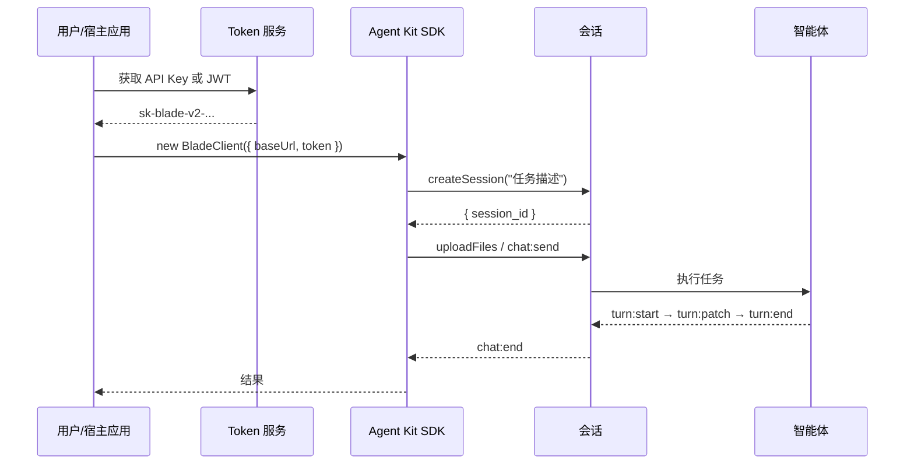

# 核心概念

## 会话（Session）

会话是一次智能体交互的完整上下文。每个会话有唯一的 `session_id`，包含消息历史、工具调用记录和工作区文件。

```ts
const { session_id } = await client.sessions.createSession("用户任务")
```

## 工作目录（Workspace）

每个会话拥有独立的文件系统目录。上传的业务文件存放在此，智能体可以读写这些文件。

```ts
// 上传文件到会话工作区
await client.sessions.uploadFiles(session_id, ".", [
  { file: new File([buffer], "report.md"), name: "report.md" },
])
```

## 访问凭证（Token）

SDK 使用 Bearer Token 鉴权，支持两种类型：

| 类型 | 格式 | 有效期 | 适用场景 |
| --- | --- | --- | --- |
| API Key | `sk-blade-v2-...` | 长期有效 | 后端服务、脚本、第三方应用 |
| Session JWT | 浏览器 cookie | 短期 | 用户已登录的同源前端 |

第三方接入优先使用 API Key。

## 工作模式

| 模式 | 字段值 | 用途 |
| --- | --- | --- |
| 规划模式 | `planning` | 拆需求、列计划、评审方案，不执行工具 |
| 干活模式 | `executing` | 调用工具、读写文件、完成业务动作 |

真实业务请求默认使用干活模式：

```ts
socket.emit("chat:send", {
  session_id,
  message: "分析上传的报告",
  mode: "executing",
})
```

## 整体流程



## SDK 包入口

| 入口 | 用途 |
| --- | --- |
| `@blade-hq/agent-kit/client` | 纯 JS Client，所有平台通用 |
| `@blade-hq/agent-kit/react` | React Provider、Hooks、Stores |
| `@blade-hq/agent-kit/chat` | React 聊天组件 ChatView |
| `@blade-hq/agent-kit/style.css` | React 组件样式 |
