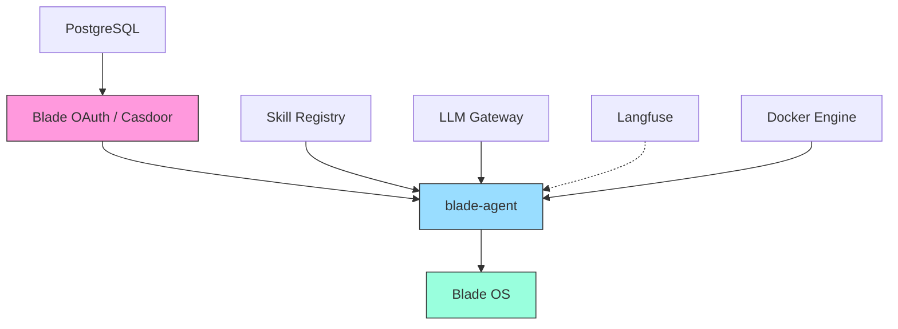

# Docker 部署

## 服务依赖关系



## 启动顺序

服务必须按以下顺序启动，确保依赖就绪：

| 启动顺序 | 服务 | 端口 | 地址 |
|---------|------|------|------|
| 1 | Blade OAuth | 19000 | `http://<host>:19000` |
| 2 | Skill Registry | 8010 | `http://<host>:8010` |
| 3 | Blade Agent | 8020 | `http://<host>:8020` |
| 4 | Blade OS | 80 | `http://<host>` |
| 5 | LLM Gateway | 30000 | `http://<host>:30000` |
| 6 | Gitea | 30030 | `http://<host>:30030` |
| 7 | Mock Center | 30023 | `http://<host>:30023` |

## Docker Compose 配置要点

### Casdoor 认证服务

```yaml
services:
  casdoor:
    image: registry.cn-beijing.aliyuncs.com/bladeai/blade-casdoor:latest
    restart: unless-stopped
    ports:
      - "9000:8000"
    volumes:
      - casdoor_data:/conf

volumes:
  casdoor_data:
```

### blade-agent 后端

blade-agent 使用 Python + FastAPI，启动命令：

```bash
uv run uvicorn blade_agent.server.app:create_app --factory --port 8020
```

关键配置：
- 不要使用 `--reload`，会导致 workspace 文件写入触发重启、断开 WebSocket
- 认证配置通过 `OAUTH_CONFIG_YAML_PATH` 指向 YAML 文件
- `BLADE_AGENT_HOST_DIR` 在容器部署时需设置为宿主机路径

### LLM Gateway

```yaml
services:
  llm-gateway:
    image: ghcr.io/blade-hq/llm-gateway:latest
    ports:
      - "29999:29999"
    volumes:
      - ./config:/app/config
```

## 健康检查

| 服务 | 端点 | 预期响应 |
|------|------|----------|
| blade-agent | `GET /api/health` | `{"status": "ok"}` |
| blade-agent | `GET /healthz` | `{"status": "ok"}` |
| LLM Gateway | `GET /health` | `{"ok": true, "sources": [...]}` |
| Casdoor | `GET /api/health` | HTTP 200 |

Docker Compose 健康检查示例：

```yaml
services:
  blade-agent:
    healthcheck:
      test: ["CMD", "curl", "-f", "http://localhost:8020/api/health"]
      interval: 30s
      timeout: 10s
      retries: 3
      start_period: 15s
```

## 数据持久化

需要持久化的目录：

| 路径 | 说明 |
|------|------|
| `workspace/` | 会话文件、工作空间数据 |
| `agent_env/skills/` | 技能快照 |
| `casdoor_data` | Casdoor 配置和数据 |
| `config/config.yaml` | LLM Gateway 源配置（会被管理 API 回写） |

## 部署自检

部署完成后，按顺序检查各服务接口是否正常响应：

```bash
# 1. Blade OAuth
curl -f http://<host>:19000/api/health

# 2. Skill Registry
curl -f http://<host>:8010/api/health

# 3. Blade Agent
curl -f http://<host>:8020/api/health

# 4. Blade OS（前端静态资源）
curl -f http://<host>/

# 5. LLM Gateway
curl -f http://<host>:30000/health

# 6. Gitea
curl -f http://<host>:30030/

# 7. Mock Center
curl -f http://<host>:30023/health
```

如果某个服务返回非 200 状态码，检查对应容器日志：

```bash
docker compose logs <service-name> --tail 50
```

## 国内镜像

在国内服务器拉取镜像时，使用 `docker.1panel.live` 代理：

```bash
# 官方镜像加 library/ 前缀
docker pull docker.1panel.live/library/redis:7
docker pull docker.1panel.live/library/postgres:17

# 第三方镜像直接用组织名
docker pull docker.1panel.live/langfuse/langfuse:3
```
